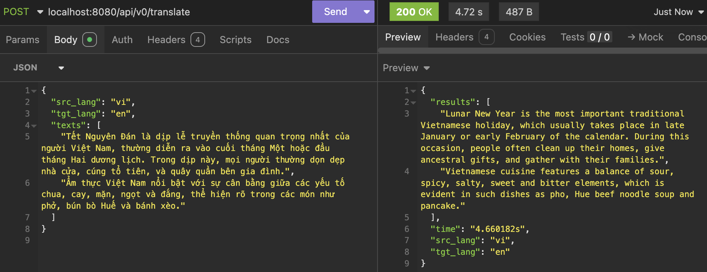
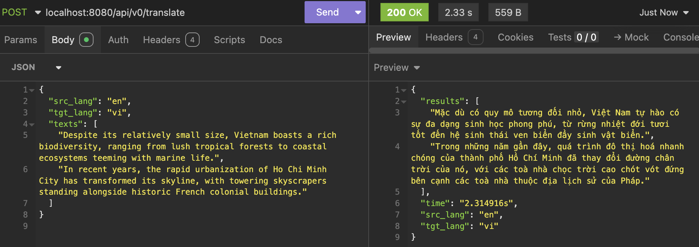
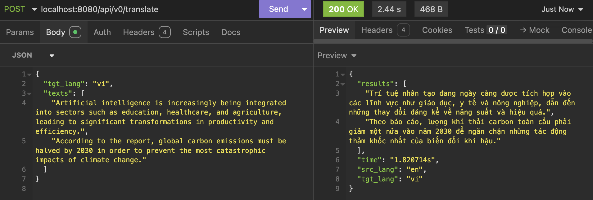

# 🧠 Translator as Service

A lightweight API for translating between English and Vietnamese using pretrained models. Supports auto language detection.


---

## 🖼️ Demo

### 🇻🇳 Vietnamese → English


---

### 🇺🇸 English → Vietnamese


---

### 🌐 Auto Detect Language
You can omit the `src_lang` field — the system will detect the language automatically:



---

## 🚀 Running Locally

```bash
# Install dependencies
pip install -r requirements.txt

# Run the application
python manage.py
