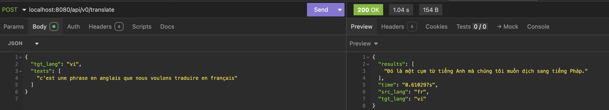

# 🧠 Translator as Service

A lightweight API for translating between English, Vietnamese, and French using pretrained models.  
Supports auto language detection and can be easily extended to other language pairs.


---

## 🌍 Supported Language Pairs

| Source | Target       |
| ------ | ------------ |
| 🇺🇸 EN  | 🇻🇳 VI, 🇫🇷 FR |
| 🇻🇳 VI  | 🇺🇸 EN, 🇫🇷 FR |
| 🇫🇷 FR  | 🇺🇸 EN, 🇻🇳 VI |

> ✅ Built-in language detection allows you to omit the `src_lang` field for most use cases.

---

## 🖼️ Demo

### 🇻🇳 Vietnamese → English


---

### 🇺🇸 English → Vietnamese


---

### 🇫🇷 French → Vietnamese



---

### 🌐 Auto Detect Language

You can omit the `src_lang` field — the system will detect the language automatically:


---

## 🔧 Easily Extensible

To add a new language pair, simply implement a new `BaseTranslator` subclass and register it in `UniversalTranslator.TRANSLATOR_FACTORIES`.

---

## 🚀 Running Locally

```bash
# Install dependencies
pip install -r requirements.txt

# Run the application
python manage.py
```
